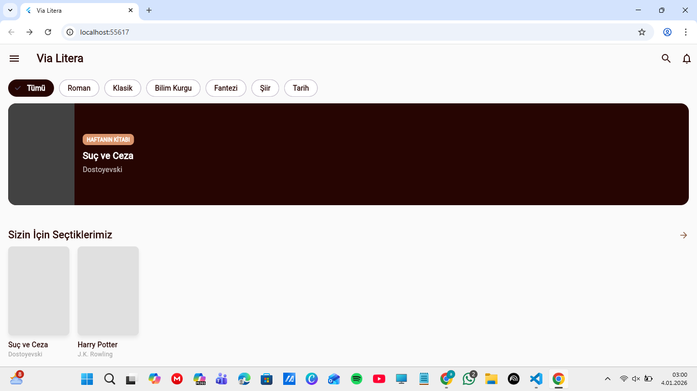
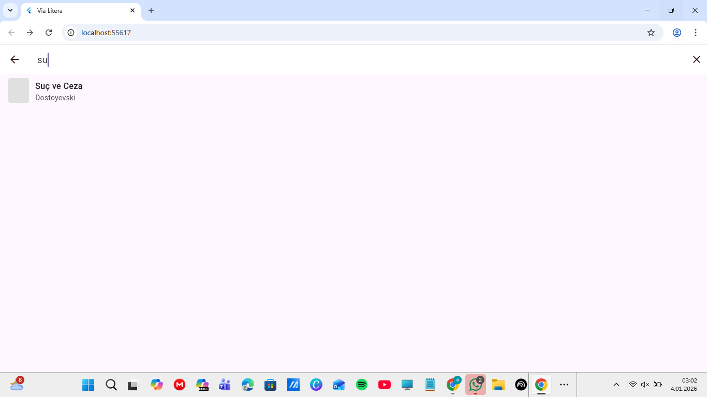
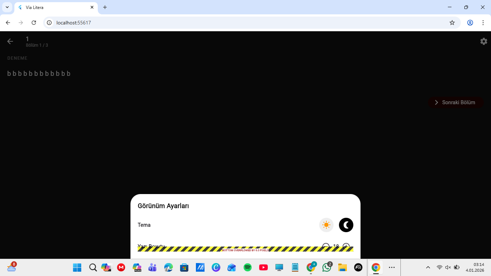
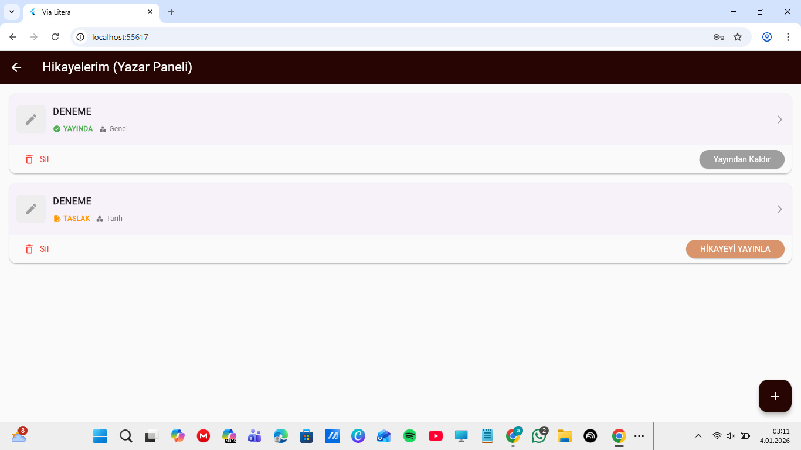
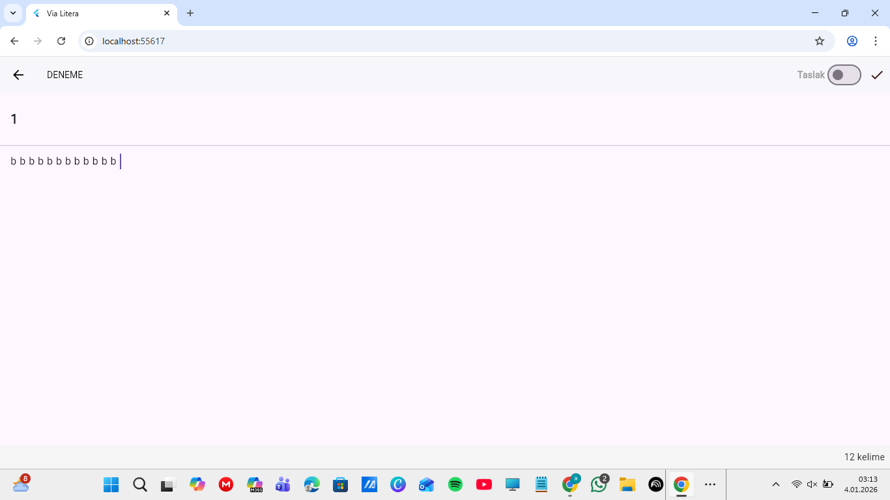
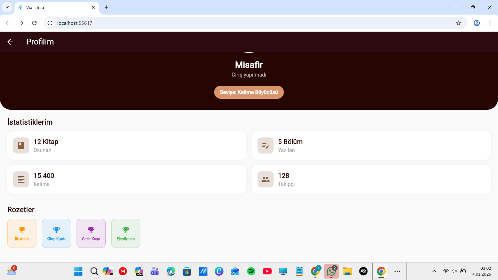
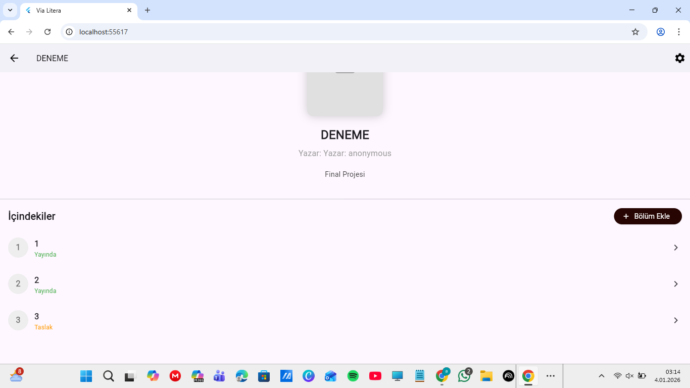

# 📚 Via Litera - Mobil Kütüphane ve Yazarlık Platformu

**Via Litera**, okuma tutkunları ile içerik üreticilerini buluşturan hibrit bir mobil uygulamadır. Storytel benzeri profesyonel bir vitrin ve okuma deneyimi sunarken, Wattpad tarzı bir yazar stüdyosu ile kullanıcıların kendi hikayelerini bölüm bölüm yazıp yayınlamasına olanak tanır.

## 🌟 Öne Çıkan Özellikler

* **Hibrit Yapı:** Hem okuyucu hem de yazar modunu tek uygulamada birleştirir.
* **Profesyonel Vitrin:** Kayan raflar, haftanın kitabı ve kategori (tür) filtreleme ile zengin ana sayfa deneyimi.
* **Gelişmiş Okuma Modu:** Göz yormayan arayüz, gece/gündüz modu ve font boyutu ayarları.
* **Yazar Stüdyosu (Wattpad Modu):**
    * Kitapları "Taslak" olarak kaydedip daha sonra düzenleyebilme.
    * Tek tuşla hikayeyi yayına alma veya yayından kaldırma.
    * Kelime sayaçlı, kağıt görünümlü sade yazma editörü.
* **Oyunlaştırma (Gamification):** Yazar seviyeleri, okuma/yazma istatistikleri ve rozet sistemi içeren profil ekranı.
* **Kalıcı Veri (Local Storage):** İnternet olmasa bile yazılan taslaklar ve veriler cihaz hafızasında saklanır, kaybolmaz.
* **Akıllı Arama:** Kitap başlığı veya yazar adına göre anlık arama yapabilme.

---

## 📸 Ekran Görüntüleri (Screenshots)

### 🏠 Keşfet ve Oku
Uygulamanın vitrini, arama motoru ve okuma deneyimi.

<table>
  <tr>
    <td align="center"> <b>Ana Sayfa Vitrin</b></td>
    <td align="center"> <b>Akıllı Arama</b></td>
    <td align="center"> <b>Gece Modu / Okuma</b></td>
  </tr>
</table>

---

### ✍️ Yazar Stüdyosu
Kendi hikayeni oluştur, yönet ve yayınla.

<table>
  <tr>
    <td align="center"> <b>Hikayelerim (Taslaklar)</b></td>
    <td align="center"> <b>Yeni Hikaye Oluşturma</b></td>
    <td align="center"> <b>Yazma Editörü</b></td>
  </tr>
</table>

---

### 👤 Profil ve Menü
Kullanıcı istatistikleri ve navigasyon.

<table>
  <tr>
    <td align="center"> <b>Navigasyon Menüsü</b></td>
    <td align="center"> <b>Profil ve İstatistikler</b></td>
  </tr>
</table>

---

## 🛠️ Kullanılan Teknolojiler

* **Framework:** Flutter
* **Dil:** Dart
* **Mimari:** MVVM (Model-View-ViewModel) & Clean Architecture Prensipleri
* **State Management:** Provider
* **Yerel Depolama:** SharedPreferences (Veri kalıcılığı için)
* **UI/UX:** Özel renk paleti, Material Design 3 bileşenleri.